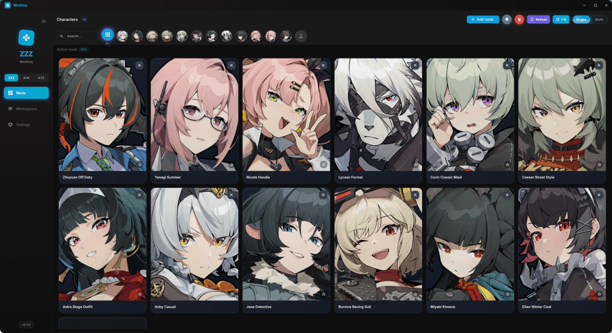

<div align="center">

# Modlinq

**One mod manager for Zenless Zone Zero, Wuthering Waves and Neverness to Everness.**
**Symlink-based, so nothing is copied and your originals are never touched.**

[](https://discord.gg/6qhjDDkANC)
[](https://github.com/hugobugomugo/Modlinq/releases/latest)


[](LICENSE)
[](https://github.com/hugobugomugo/Modlinq/releases)

</div>

> [!TIP]
> Modlinq updates itself. When a new release lands you get a prompt inside the app, it verifies the download against its sha256, swaps the install and restarts. No manual re-download.

## Supported games

| Game | Loader | Install detection |
|------|--------|-------------------|
| Zenless Zone Zero | 3DMigoto / XXMI | manual path |
| Wuthering Waves | 3DMigoto / XXMI | manual path |
| Neverness to Everness | native | automatic (Steam, Wine and Proton prefixes) |

## Screenshots



Mods grouped by character, enabled and disabled with a click. The sidebar switches between ZZZ, WW and NTE; each game keeps its own roster, paths and settings.

## Community

Questions, mod help, bug reports and release pings: [discord.gg/6qhjDDkANC](https://discord.gg/6qhjDDkANC)

## Features

- Enable and disable mods by symlink, instantly, without moving files
- Per-game character rosters with automatic tagging from folder names
- `Misc` bucket for manual grouping and `Unknown` bucket for unmatched mods
- Import by drag and drop, path paste (Ctrl+V), file picker, or `.zip` / `.rar` / `.7z` archive
- Single mode (one mod per character) or multi mode (many)
- Character search and filtering
- NTE: automatic install discovery, dedicated mod library and installer
- ZZZ: F10 auto-reload sent to the game on mod change
- Per-game settings, dark and light theme, English and Ukrainian

## Install

Download the release build for your platform from [Releases](https://github.com/hugobugomugo/Modlinq/releases).

Linux runtime dependencies: `gtk3`, `glib2`, `libx11`.

Optional, for ZZZ F10 auto-reload:

- Wayland: `ydotool`, `wmctrl`, `xdotool`, user in the `input` group, `ydotool.service` enabled
- X11: `xdotool`, `wmctrl`

## Build from source

Requires Flutter 3.44.8.

```bash
git clone https://github.com/hugobugomugo/Modlinq.git
cd Modlinq/mod_manager_flutter
flutter pub get
flutter build linux --release      # or: flutter build windows --release
```

Linux binary: `build/linux/x64/release/bundle/modlinq`

Run the test suite and the analyzer before opening a pull request:

```bash
flutter analyze
flutter test
```

## Data locations

| Platform | Path |
|----------|------|
| Linux | `~/.local/share/modlinq/` |
| Windows | `%APPDATA%\modlinq\` |

Holds `config.json`, cached mod images, and the NTE mod library.

## Credits

Fork of [NotionMe/Mod-manager](https://github.com/NotionMe/Mod-manager).

## License

MIT
